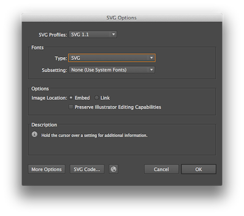

# Icons

List of icon previews are added to this readme using [update-readme.py](update-readme.py).

Setup pre-commit hook to automatically update readme after each commit. Run in root of this project:

    sh git-hooks/install-hooks.sh

## Adding new icons

You need to add 3 files to assets folder

* **icon.svg** - original vector icon
* **icon.png** - 1200x1200 sized icon in .png format
* **icon_preview.png** - 100x100 sized icon in .png format

Save .svg using these settings

## All icons

##### Magnifying Glass

